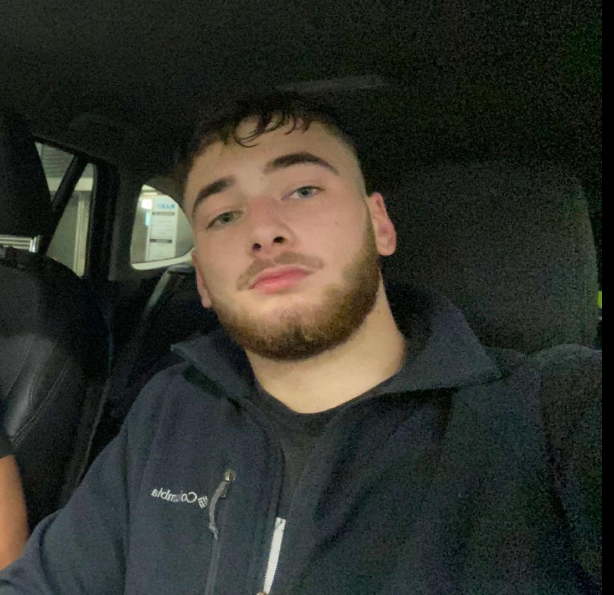

+++
title = "Wie Leistungssport die Identität beeinflusst"
date = "2025-02-28"
draft = false
pinned = false
tags = ["Interview", "Boxen", "Leistungssport"]
image = "whatsapp-bild-2025-02-28-um-14.29.52_91e0138a.jpg"
+++
"Ich bin allgemein durch den Sport viel zielstrebiger geworden. Ja es hat mich verändert, aber auf eine positive Weise." Raul Friedli

 Raul Friedli wurde 13.09.2002 in Bern geboren und wuchs im Quartier Tiefenau auf. Im Jahre 2016 fing er an zu Boxen und zwei Jahre darauf meldete er sich für seine erste Lizenz an und fing an im Olympischen Boxen Kämpfe zu bestreiten.  

**Rocco: Wie bist du zum Leistungssport gekommen und was war damals deine Motivation?**

Raul: Ich war schon als Kind begeistert vom Sport allgemein und habe danach meinen Weg zum Boxen gefunden und seither bleibe ich beim Boxen.

**Welchen Einfluss hat der Leistungssport auf dein tägliches Leben und auf deine Routine?**

Ich finde, der Leistungssport beeinflusst mein Leben allgemein sehr positiv, indem ich gesünder esse, schon nur die körperliche Bewegung, dadurch kann ich mich auch in meinem Alltagsleben besser konzentrieren, jedoch nimmt es auch viel Zeit in Anspruch.

**Fühlst du dich manchmal nur noch als Sportler? Und wenn ja, wie beeinflusst das dein Selbstbild?**

Manchmal fühlt man sich schon stark als Boxer. Mein Selbstbild, würde ich sagen, beeinflusst es eher positiv. Es gibt mir eine Art Motivation und Fokus in meinem Leben.

**Inwiefern hat der Leistungssport deine Beziehung zu Familie und Freunden verändert?**

Durch den Leistungssport, habe ich weniger Kontakt zu Familie sowie Freunden, da ich jeden Tag trainieren gehe und dadurch auch immer zum Beispiel alleine Abendessen, was eigentlich eine Familienangelegenheit ist. Und auch mit Freunden nimmt es  mir viel Zeit weg, wenn zum Beispiel Freunde am Wochenende feiern gehen oder etwas machen wollen, bin ich meistens schon am Samstagmorgen früh im Training oder unter der Woche halt abends und morgens.

**Hat sich dein Verhältnis zu Erfolg und Misserfolg im Laufe der sportlichen Karriere verändert?**

Ich bin allgemein durch den Sport viel zielstrebiger geworden, deshalb würde ich sagen, ja es hat sich verändert, aber in das Positive. Ich bin fokussierter, zielstrebiger und kann besser in die Zukunft blicken und Dinge planen.

**Welche persönlichen Werte oder Überzeugungen hast du durch den Leistungssport stärker entwickelt?**

Ich bin natürlich ehrgeiziger geworden und fokussierter, viel fokussierter und ich würde sagen, ich habe ein grösseres Selbstbewusstsein erlangt. Zum Beispiel, wenn ich Präsentationen vorführe in der Schule, habe ich viel weniger Angst davor. Man kann ja auch nicht Angst davor haben, in den Boxring zu steigen. 

**Fühlst du, dass die Gesellschaft dich hauptsächlich als Sportler sieht? Wie gehst du damit um?**

Für mich ist es schon ein großer teil meines Lebens jedoch sieht man mich ja jetzt nicht schlechter, im Gegenteil. Es ist etwas gutes wenn die Menschen sehen das man Sport macht. Man sieht es schon an der körperlichen Verfassung, alles in allem finde ich es gar nichts negatives.

**Inwiefern haben sich deine eigenen Erwartungen an dich selbst im Vergleich zu den anderen verändert?**

Ich denke, meine Erwartungen sind auf den Sport bezogen, sehr hoch und auch durch den Ehrgeiz, den das Training mit sich bringt. Jedoch allgemein denke ich, jeder steckt sich seine Ziele dort, wo man denkt, man kann sie auch erreichen, man sollte einfach dranbleiben und Spass haben.

> "Jetzt weiss ich, dass ich viel mehr von mir erwarten kann und viel mehr erreichen kann." Raul Friedli

**Wie gehst du mit den psychischen Belastungen um, die mit dem Leistungssport einhergehen und was macht es mit deinem Selbstbewusstsein?**

Die psychischen Belastungen sind eine grosse Schwierigkeit, wahrscheinlich eine der grössten. Jedoch, wenn man sie überwinden kann, ist es nachher ein Riesenvorteil. Also ich denke, ich gehe sehr gut damit um. Ich versuche einfach im Moment zu leben und nicht Angst zu haben vor der Zukunft.

**Gibt es Aspekte deines Lebens, die du wegen des Leistungssports opfern musstest und wie fühlst du dich darüber?**

Ich musste wegen des Leistungssports wie gesagt viel Zeit mit der Familie opfern oder auch mit Freunden. Es geht viel drauf, zum Beispiel am Valentinstag, statt etwas mit meiner Freundin zu machen, war ich im Training und wir haben uns dann nur am Abend kurz gesehen. Das ist schon ein bisschen schade. Zum Glück hat sie Verständnis.

**Hat der Leistungssport dir geholfen, dich als Mensch weiterzuentwickeln? Wenn ja, auf welche Weise?**

Der Leistungssport hat mir bestimmt geholfen, mich weiterzuentwickeln. Ich war früher viel fauler und habe auch weniger an mich geglaubt, mir meine Ziele weniger hoch gesteckt. Jetzt weiss ich, dass ich viel mehr von mir erwarten kann und viel mehr erreichen kann. Dadurch hat sich mein kompletter Lebensstil verbessert. 

**Raul hat in zwei Wochen einen Kampf** 

**Bist du gut vorbereitet? Wie fühlst du dich?**

Ich denke körperlich bin ich mittlerweile ziemlich fit. Meine Schulter spürt sich noch ein wenig, von der letzten Verletzung. Was mir etwas auf die Psyche geht ist, dass meine letzten zwei Sparrings eher schwach waren. Das muss in dieser Woche verbessert werden. Und nachher sieht das perfekt aus, um den nächsten Kampf zu gewinnen.

